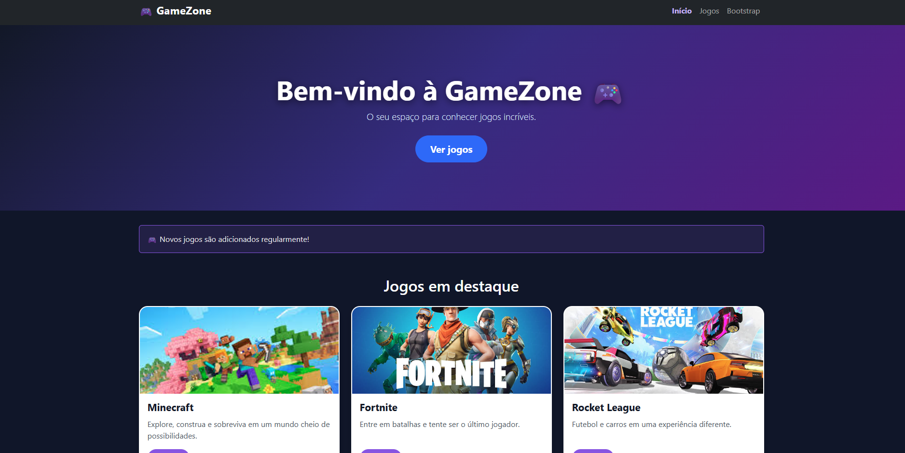

# 🎮 GameZone



## 👨‍💻 Desenvolvedores

- Anthonny Daniel
- Hugo
- Thiago

## 📌 Descrição do projeto

O GameZone é um site desenvolvido para apresentar e conhecer diferentes jogos.

O projeto foi criado como atividade prática para aprender e aplicar o framework Bootstrap no desenvolvimento web.

## 🚀 Como acessar o projeto

Para acessar o GameZone, basta abrir o arquivo `index.html` em um navegador.

O projeto também está disponível neste repositório do GitHub:
[GameZone no GitHub](https://github.com/hugohilarion-criar/GameZone)

## 🎯 Objetivo do projeto

O objetivo do GameZone é apresentar diferentes jogos de forma organizada e visualmente agradável, utilizando HTML, CSS e Bootstrap.

O projeto também foi desenvolvido para colocar em prática os conhecimentos aprendidos sobre desenvolvimento web e o uso do framework Bootstrap.

## 🎮 Jogos disponíveis

O GameZone apresenta alguns jogos populares:

- 🟩 Minecraft
- 🟦 Fortnite
- 🚗 Rocket League

## 🎯 Tema escolhido

🎮 Jogos

O site apresenta jogos populares como:

- Minecraft
- Fortnite
- Rocket League

## 🛠️ Tecnologias utilizadas

- HTML5
- CSS3
- Bootstrap 5.3.3

## 📚 O que foi utilizado do Bootstrap

Durante o desenvolvimento foram utilizados diversos recursos do Bootstrap, como:

- Navbar
- Container
- Grid
- Cards
- Botões
- Alertas
- Badges
- Classes de responsividade

## 🌐 Links

### GitHub
https://github.com/hugohilarion-create/Projeto-GameZone

### Site publicado
https://gamezone-henna.vercel.app/

## 📱 Responsividade

O site foi desenvolvido para funcionar em diferentes tamanhos de tela:

- 📱 Celulares
- 📱 Tablets
- 💻 Notebooks
- 🖥️ Monitores

Foi utilizado o sistema de Grid do Bootstrap para adaptar o conteúdo.

Exemplo:

```html

<div class="col-12 col-md-6 col-lg-4">